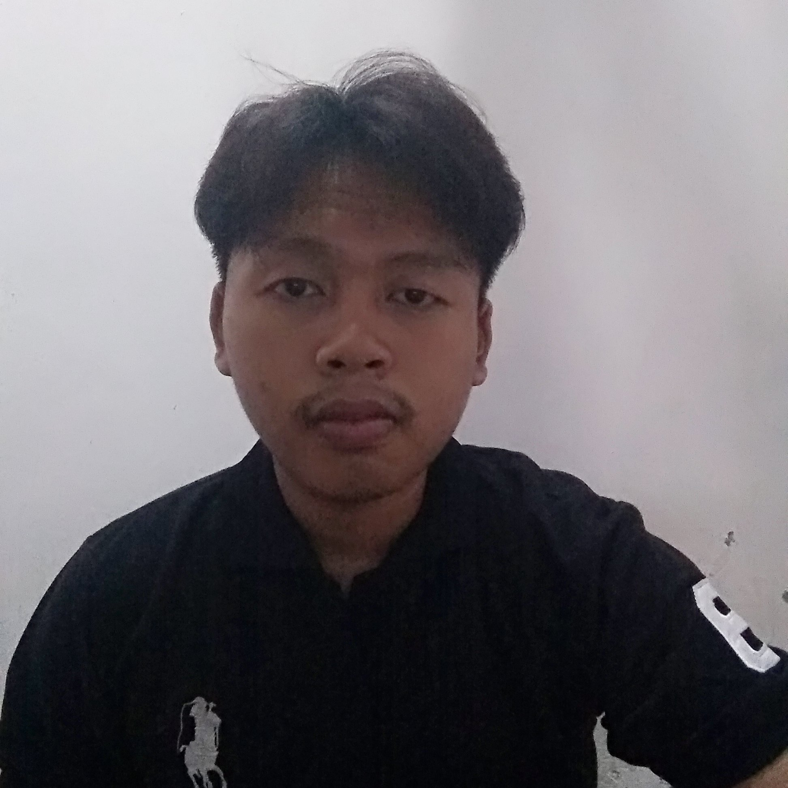
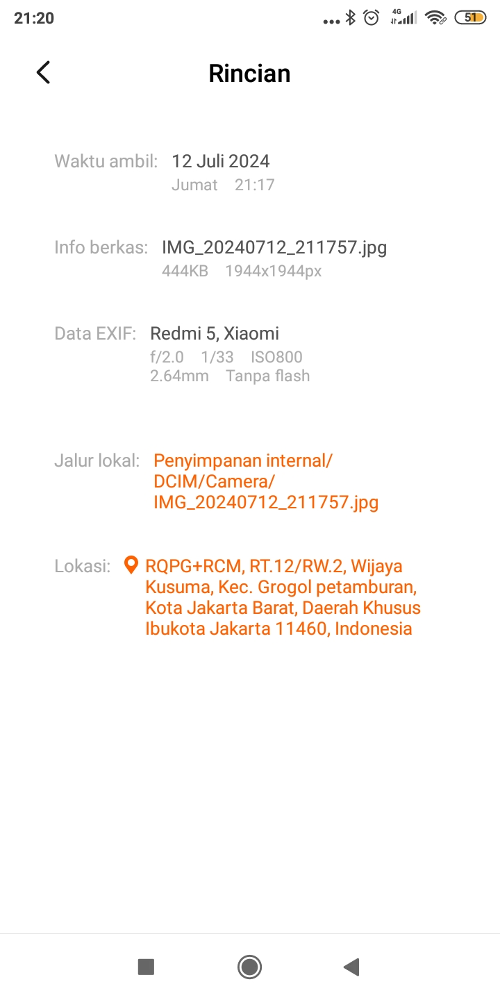
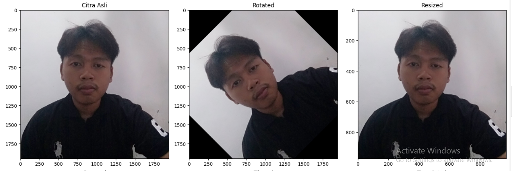
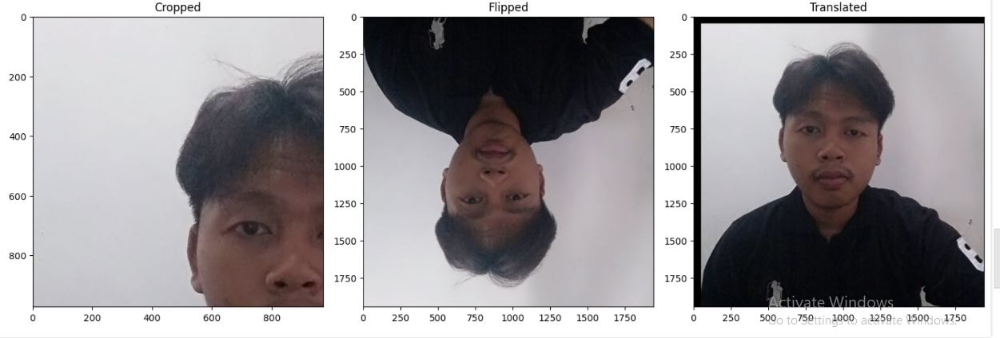

# Ulangan Akhir Semester Pengolahan Citra Digital
#### Nama : Muhammad Amrizal
#### NIM  : 202231500
#### 1. Pengolahan Citra Digital
Pengolahan citra digital adalah proses memanipulasi citra digital menggunakan berbagai algoritma komputer untuk meningkatkan kualitas citra atau mengekstrak informasi yang bermanfaat. Pengolahan citra digital mencakup berbagai teknik dan metode yang dapat diterapkan untuk tujuan yang berbeda, seperti peningkatan kualitas, analisis, dan pengenalan pola. Berikut adalah beberapa teknik utama dalam pengolahan citra digital:

* Pemfilteran: Proses ini melibatkan penggunaan filter untuk mengubah citra dengan cara tertentu. Filter dapat digunakan untuk menghaluskan citra, menghilangkan noise, atau menonjolkan fitur-fitur tertentu. Contoh filter termasuk filter rata-rata, filter median, dan filter Gaussian.

* Segmentasi: Segmentasi adalah proses membagi citra menjadi bagian-bagian yang lebih kecil atau objek-objek terpisah berdasarkan karakteristik tertentu, seperti warna, intensitas, atau tekstur. Teknik segmentasi yang umum meliputi thresholding, k-means clustering, dan algoritma watershed.

* Transformasi Geometris: Transformasi ini melibatkan perubahan koordinat piksel dalam citra untuk menghasilkan efek tertentu, seperti rotasi, penskalaan, translasi, dan flipping. Transformasi geometris sering digunakan dalam pra-pemrosesan citra untuk memastikan citra dalam posisi dan ukuran yang sesuai untuk analisis lebih lanjut.

* Enhancement (Peningkatan Citra): Teknik ini digunakan untuk meningkatkan kualitas visual citra dengan menonjolkan fitur-fitur penting dan mengurangi artefak yang tidak diinginkan. Contoh peningkatan citra termasuk penyesuaian kontras, peningkatan tepi, dan perbaikan warna.

* Transformasi Domain Frekuensi: Transformasi ini, seperti Transformasi Fourier, digunakan untuk mengubah citra dari domain spasial ke domain frekuensi, memungkinkan analisis dan manipulasi komponen frekuensi citra.

Pengolahan citra digital memiliki aplikasi luas, termasuk dalam bidang medis (misalnya, pemrosesan citra medis untuk diagnosis), pengawasan (misalnya, pengenalan wajah dan deteksi objek), dan industri kreatif (misalnya, pengeditan foto dan video).

#### 2. Transformasi Geometris
Transformasi geometris adalah teknik yang digunakan untuk mengubah citra dengan cara mengubah koordinat pikselnya. Teknik ini digunakan dalam berbagai aplikasi untuk mempersiapkan citra dalam bentuk yang diinginkan atau untuk memperbaiki distorsi. Berikut adalah beberapa jenis transformasi geometris yang umum:
 * Rotasi (Rotated)
Rotasi adalah proses memutar citra dengan sudut tertentu searah jarum jam atau berlawanan arah jarum jam. Fungsi ini digunakan untuk mengubah orientasi citra. Pada contoh ini, citra dirotasi sebesar 45 derajat menggunakan fungsi `cv2.getRotationMatrix2D` dan `cv2.warpAffine` dari OpenCV.

* Penskalaan (Resized)
Penskalaan adalah proses mengubah ukuran citra, baik memperbesar maupun memperkecilnya, dengan menggunakan faktor skala tertentu. Penskalaan dapat digunakan untuk menyesuaikan citra ke dalam resolusi yang diinginkan atau untuk normalisasi ukuran citra sebelum analisis lebih lanjut. Fungsi `cv2.resize` dari `OpenCV` digunakan untuk melakukan penskalaan.

* Pemotongan (Cropped)
Pemotongan adalah proses mengambil bagian tertentu dari citra dan menghilangkan bagian lainnya. Ini berguna untuk memfokuskan pada area yang diinginkan atau untuk mengisolasi objek tertentu dalam citra. Pemotongan dilakukan dengan menggunakan slicing pada array `numpy` yang mewakili citra.

* Pembalikan (Flipped)
Pembalikan adalah proses membalik citra secara horizontal atau vertikal. Teknik ini dapat digunakan untuk menghasilkan efek cermin atau untuk memperbaiki orientasi citra. Fungsi `cv2.flip` dari OpenCV digunakan untuk melakukan pembalikan.

* Translasi (Translated)
Translasi adalah proses menggeser citra dalam arah horizontal atau vertikal. Ini dilakukan dengan menggunakan matriks translasi dan fungsi `cv2.warpAffine` dari OpenCV. Translasi berguna untuk mengubah posisi citra dalam bingkai koordinat tanpa mengubah bentuk atau ukurannya.

# Tahapan Cara Menyelesaikan Proyek
Siapkan gambar yang akan diolah


* Import Library
``` python
import cv2 
import numpy as np
import matplotlib.pyplot as plt 
``` 

`import cv2`: Ini mengimpor modul OpenCV, yang diperlukan untuk memproses citra.

`import numpy as np`: Ini mengimpor NumPy, pustaka yang digunakan untuk komputasi numerik, yang sering digunakan dalam pengolahan citra.

`import matplotlib.pyplot as plt`: Ini mengimpor modul pyplot dari pustaka Matplotlib, yang akan digunakan untuk menampilkan gambar dan plot.

* Load the image

```python
image_path = "citra.jpg" 
img = cv2.imread(image_path)
```
Ini adalah langkah pertama di mana gambar dengan nama file "citra.jpg" dimuat menggunakan cv2.imread

* Salin citra ke variabel khusus
```python
img_copy = img.copy()
```
Setelah gambar dimuat, citra tersebut disalin ke variabel `img_copy`. Ini dilakukan agar operasi yang dilakukan selanjutnya tidak memodifikasi citra asli (img), tetapi hanya pada salinan (`img_copy`).

* Dapatkan atribut khusus citra (ukuran)
```python
height, width = img_copy.shape[:2]
```
Menggunakan `shape` dari numpy array (`img_copy.shape`), kita mendapatkan atribut khusus dari citra yaitu tinggi (`height`) dan lebar (`width`). Atribut ini digunakan untuk mengetahui dimensi citra yang sedang diolah.

 #### 1. Citra Asli
```python
original = img_copy
```
Variabel original menyimpan salinan gambar asli yang telah dimuat sebelumnya (`img_copy`). Gambar ini akan digunakan sebagai referensi atau untuk ditampilkan dalam kondisi aslinya tanpa modifikasi.
#### 2. Rotated
```python
(h, w) = img_copy.shape[:2]
center = (w // 2, h // 2)
M = cv2.getRotationMatrix2D(center, 45, 1.0)  
rotated = cv2.warpAffine(img_copy, M, (w, h))
```
Kode ini melakukan rotasi sebesar 45 derajat terhadap citra. Pertama, ukuran gambar (tinggi dan lebar) diperoleh, lalu titik tengah gambar dihitung sebagai pusat rotasi. Matriks transformasi M dihitung menggunakan `cv2.getRotationMatrix2D`, dan gambar diputar dengan menggunakan `cv2.warpAffine`.

#### 3. Resized

```python
resized = cv2.resize(img_copy, (w // 2, h // 2)) 
```
Kode ini mengubah ukuran gambar menjadi setengah dari ukuran aslinya. Fungsi `cv2.resize` digunakan untuk mengubah ukuran gambar dengan skala yang telah ditentukan.

#### 4. Cropped
```python
cropped = img_copy[0:h // 2, 0:w // 2] 
```
Kode ini memotong setengah bagian kiri atas dari gambar. Pemotongan dilakukan dengan mengambil subset dari array gambar mulai dari koordinat (0,0) hingga (w/2, h/2).


#### 5. Flipped
```python
flipped = cv2.flip(img_copy, 0) 
```
Kode ini membalik gambar secara vertikal menggunakan cv2.flip. Parameter 0 menunjukkan bahwa pembalikan dilakukan pada sumbu x (vertikal).


#### 6. Translated (digeser)
```python
M = np.float32([[1, 0, 50], [0, 1, 50]]) 
translated = cv2.warpAffine(img_copy, M, (w, h))
```
Kode ini menggeser gambar sejauh 50 piksel ke kanan dan 50 piksel ke bawah. Matriks transformasi M disiapkan dengan nilai translasi yang diinginkan, dan `cv2.warpAffine` digunakan untuk menerapkan translasi pada gambar.

* Convert BGR to RGB for matplotlib
```python
original = cv2.cvtColor(original, cv2.COLOR_BGR2RGB)
rotated = cv2.cvtColor(rotated, cv2.COLOR_BGR2RGB)
resized = cv2.cvtColor(resized, cv2.COLOR_BGR2RGB)
cropped = cv2.cvtColor(cropped, cv2.COLOR_BGR2RGB)
flipped = cv2.cvtColor(flipped, cv2.COLOR_BGR2RGB)
translated = cv2.cvtColor(translated, cv2.COLOR_BGR2RGB)
```
Kode ini berfungsi untuk mengonversi gambar dari format BGR (Blue, Green, Red) ke format RGB (Red, Green, Blue).

* Display the images with their attributes
```python
plt.figure(figsize=(15, 10))
```
`plt.figure()`: Membuat sebuah figure baru di matplotlib. Figure ini adalah wadah utama untuk semua elemen visual seperti subplot.

`figsize=(15, 10)`: Menentukan ukuran figure dalam satuan inci. Parameter ini berarti lebar figure adalah 15 inci dan tinggi figure adalah 10 inci. Ukuran ini membantu untuk memastikan bahwa semua subplot memiliki ruang yang cukup untuk ditampilkan dengan jelas dan tidak terlalu berdesakan.

* Citra Asli
```python
plt.subplot(2, 3, 1)
plt.imshow(original)
plt.title('Citra Asli')
plt.xlim(0, width)
plt.ylim(height, 0)
```

* Rotated
```python
plt.subplot(2, 3, 2)
plt.imshow(rotated)
plt.title('Rotated')
plt.xlim(0, rotated.shape[1])
plt.ylim(rotated.shape[0], 0)
```

* Resized
```python
plt.subplot(2, 3, 3)
plt.imshow(resized)
plt.title('Resized')
plt.xlim(0, resized.shape[1])
plt.ylim(resized.shape[0], 0)
```

* Cropped
```python
plt.subplot(2, 3, 4)
plt.imshow(cropped)
plt.title('Cropped')
plt.xlim(0, cropped.shape[1])
plt.ylim(cropped.shape[0], 0)
```

* Flipped
```python
plt.subplot(2, 3, 5)
plt.imshow(flipped)
plt.title('Flipped')
plt.xlim(0, flipped.shape[1])
plt.ylim(flipped.shape[0], 0)
```

* Translated
```python
plt.subplot(2, 3, 6)
plt.imshow(translated)
plt.title('Translated')
plt.xlim(0, translated.shape[1])
plt.ylim(translated.shape[0], 0)
```
Kode ini berfungsi untuk menampilkan berbagai gambar hasil transformasi citra dalam beberapa subplot menggunakan matplotlib. Setiap subplot berisi gambar dengan atribut lebar dan tinggi yang diatur menggunakan `plt.xlim()` dan `plt.ylim()`

`plt.subplot()`: Membuat subplot pada posisi yang ditentukan

`plt.imshow()`: Menampilkan citra.

`plt.title()`: Memberikan judul pada subplot.

`plt.xlim()`: Mengatur batas sumbu X dari lebar citra

`plt.ylim()`: Mengatur batas sumbu Y dari tinggi citra 

* Terakhir

```python
plt.tight_layout()
plt.show()
```
Fungsi: Mengatur tata letak subplot agar tidak saling tumpang tindih dan menampilkan semua citra di kanvas.





